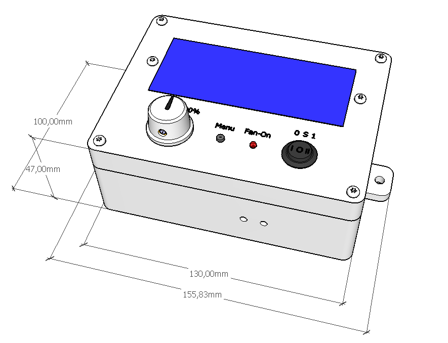

## EN: Adjustable-Humidity-Switch
**Simple (de-)humidifier-switch for all basements.**

<iframe src="GLTF_Viewer.html" width="800" height="600" frameborder="0" allowfullscreen></iframe>

Power switch with adjustable humidity limit to save power in a basement dehumidifier.
Together with a dehumidifier or a mobile air conditioner, possibly with additional exhaust air, this is a way to keep the poisonous "Aspergillus" (black or green mold) found in almost all basements away without using too much electricity. Unfortunately, with most dehumidifiers the fan is always running - it cannot be switched off - and a ~800W to 3500W device can "eat up" a lot of electricity (150W for the fan?) - even if the compressor consumes most of it.
The programming of the board (Arduino Pro Mini module) can be created or optimized quite easily these days with ChatGPT, although this still involves quite a lot of corrections or requests that usually have to be provided later. But at least you save a lot of time troubleshooting the program (sequence).
Another advantage of such an exhaust air device compared to air conditioning systems or dehumidifiers: the moist, warm air is transported outside and the (indoor) air temperature remains approximately the same (air exchange).
The humidity threshold (the best relative humidity for people is between 50-60%) - and can be set with this switch. With a small hysteresis (approx. -8% below the set value) the dehumidifier is switched off.
As a humidity sensor I chose a capacitor type, the DHT22. The DHT series is relatively stable and insensitive to environmental influences.

## DE: Einstellbarer Feuchte-Schalter
**Einfacher (Ent-)Feuchter-Schalter für alle Keller.**

Zusammen mit einem Luftentfeuchter oder einem mobilen Klimagerät, evtl. mit zusätzlicher Abluft, ist dies eine Möglichkeit, den in fast allen Kellern anzutreffenden, giftigen "Aspergillus" (schwarzer oder grüner Schimmelbefall) fernzuhalten, ohne dabei allzu viel Strom zu verbrauchen. Bei den meisten Luftentfeuchtern läuft nämlich der Ventilator leider immer durch - nicht abschaltbar - und so ein ~800W bis 3500W Gerät kann tüchtig "Strom fressen" (150W für den Lüfter?) - auch wenn der Kompressor das Meiste davon schluckt.
Die Programmierung des Boards (Arduino-Pro-Mini Modul) kann man heutzutage mit ChatGPT recht einfach erstellen bzw. optimieren, obwohl das noch mit recht vielen Korrekturen bzw. Wünschen einhergeht, die man meist noch nachliefern muss. Aber immerhin, man spart zumindest eine Menge Zeit für die Fehlersuche im Programm(ablauf).
Ein weiterer Vorteil eines solchen Abluft-Gerätes gegenüber Klimaanlagen oder Entfeuchtern: die feuchte, warme Luft wird nach draußen befördert und die (Innen-)Lufttemperatur bleibt annähernd gleich (Luftaustausch).
Die Feuchtigkeits-Schwelle (am besten für Menschen ist eine relative Luftfeuchtigkeit zwischen 50-60%) - und ist bei diesem Schalter einstellbar. Mit einer kleinen Hysterese (ca. -8% unter dem eingestellten Wert) wird der Entfeuchter ausgestellt.
Als Feuchtesensor habe ich einen Kondensator-Typ gewählt, den DHT22. Die DHT-Serie ist gegen Umwelteinflüsse relativ stabil und unempfindlich.
