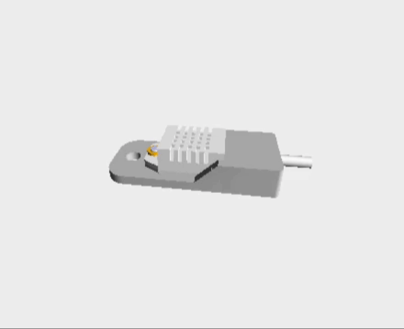

### Adjustable-Humidity-Switch

## EN: Adjustable Humidity-Switch
**Simple (de-)humidifier switch for all basements.**

Together with a dehumidifier or a mobile air conditioner, possibly with additional exhaust air, this is a way to keep out the poisonous "Aspergillus" (black or green mold) found in almost all basements, without using too much electricity. Unfortunately, with most dehumidifiers, the fan is always running - it cannot be switched off - and a ~800W to 3500W device can "eat up" a lot of electricity (150W continuous power for the fan?) - even if the compressor consumes most of it.  
What many people don't know or don't think about is that in many basements an invisible, radioactive gas diffuses out of the ground: radon. This gas is also odorless, so it is not noticeable, but acts like smoke - and in concentrations higher than the recommended limit (300 Bq/m³) it can attack the lungs in the long term... So if you are thinking of setting up a workspace or bedroom in the basement, you should also set up an appropriate extraction system.  
Another advantage of such an exhaust device compared to air conditioning systems or dehumidifiers: the moist, warm (+radon-containing) air is transported outside and the (indoor) air temperature remains almost the same without heating up (compressor waste heat).  
This switch works with a power relay, which can switch a consumer/device up to approx. 1400W on or off.  
The humidity threshold (the best for people is a relative humidity between 50-60%) - can be set with this switch. The dehumidifier is switched off with a small hysteresis (approx. -8% below the set value).  
I chose a capacitor type for the humidity sensor, the DHT22, because the DHT series is relatively stable and insensitive to environmental influences.  
I created and optimized the programming of the "Arduino Mini Pro" module, which handles the control and the LCD display, with the help of ChatGPT. This help makes troubleshooting in the program sequence much easier these days - so debugging is already extremely easyer.  
If you want to recreate the electronics required for this yourself, you can do it on a perforated board or recreate the board quite easily with the help of external service providers such as Eurocircuits or others. There are even (expensive) offers that take care of the assembly of the circuit board themselves. However, soldering in the few "THD" components should not be a problem for a DIY hobbyist.  

## DE: Einstellbarer Feuchte-Schalter
**Einfacher (Ent-)Feuchte Schalter für alle Keller.**

Zusammen mit einem Luftentfeuchter oder einem mobilen Klimagerät, evtl. mit zusätzlicher Abluft, ist dies eine Möglichkeit, den in fast allen Kellern anzutreffenden, giftigen "Aspergillus" (schwarzer oder grüner Schimmelbefall) fernzuhalten, ohne dabei allzu viel Strom zu verbrauchen. Bei den meisten Luftentfeuchtern läuft nämlich der Ventilator leider immer durch - nicht abschaltbar - und so ein ~800W bis 3500W Gerät kann tüchtig "Strom fressen" (150W Dauerleistung für den Lüfter?) - auch wenn der Kompressor das Meiste davon schluckt.  
Was viele zudem nicht wissen oder nicht daran denken - in vielen Kellern diffundiert ein unsichtbares, radioaktives Gas aus dem Boden: Radon. Dieses Gas ist zudem geruchlos, also nicht wahrnehmbar, wirkt aber wie Rauch - und kann in höherer Konzentration als dem empfohlenen Grenzwert (300 Bq/m³) längerfristig die Lunge angreifen... Falls man also gedenkt im Keller einen Arbeitsplatz oder ein Schlafzimmer einzurichten, sollte man dazu auch gleich eine entsprechende Absauganlage einrichten.  
Ein weiterer Vorteil eines solchen Abluft-Gerätes gegenüber Klimaanlagen oder Entfeuchtern: die feuchte, warme (+radonhaltige) Luft wird nach draußen befördert und die (Innen-)Lufttemperatur bleibt annähernd gleich, ohne sich zu erhitzen (Kompressor-Abwärme).  
Dieser Schalter arbeitet mit einem Power-Relais zusammen, welches einen Verbraucher/Gerät bis zu ca. 1400W ein- bzw. ausschalten kann.  
Die Feuchtigkeits-Schwelle (am besten für Menschen ist eine relative Luftfeuchtigkeit zwischen 50-60%) - ist bei diesem Schalter einstellbar. Mit einer kleinen Hysterese (ca. -8% unter dem eingestellten Wert) wird der Entfeuchter ausgestellt.  
Als Feuchtesensor habe ich einen Kondensator-Typ gewählt, den DHT22, da die DHT-Serie gegen Umwelteinflüsse relativ stabil und unempfindlich ist.  
Die Programmierung des "Arduino-Mini-Pro" Moduls, welches die Steuerung und die LCD-Anzeige übernimmt, habe ich mit Hilfe von ChatGPT erstellt und optimiert. Diese Hilfe vereinfacht heutzutage die Fehlersuche im Programmablauf - das "debugging" schon extrem.  
Wer die dazu erforderliche Elektronik selbst nachbauen will, kann diese auf einer Lochrasterplatine oder das Board mit Hilfe von externen Dienstleistern wie Eurocircuits o.a. auf recht einfache Weise nachbauen. Es gibt dazu sogar (teure) Angebote, die selbst die Bestückung der Leiterplatte übernhemen. Die wenigen "THD"-Bauteile einzulöten sollte aber kein Problem für einen DIY-Bastler sein.  
